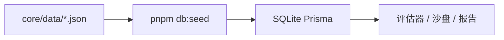

# 数值平衡与 AI 报告

本文说明评估器、沙盘、平衡报告如何协作，以及调参时应改哪些文件。

## 目标区间（规则预检）

| 场景 | 指标 | 目标胜率 |
|------|------|----------|
| 破境守门 | `realmSweep.vsNextGate`，标准 milestone 养成 vs **下一细境界** | 38%–72%（爽感约 42–58%） |
| 章节 BOSS | `realmSweep.vsBandPreset`，动态守方 + `chapterBossTemplateScale` | 25%–55% |
| 沙盘校验 | 当前手配 vs 守方（非 milestone） | 仅供参考，常偏高 |

公式与对战模拟均在 `packages/core`（`simulateDuel`、`calculateRatedPower`），**不要**在 Web 组件里改战力。

## 数据流



- **权威样例**：`packages/core/src/data/` 下 JSON（境界、装备库、功法库、主角默认、meta）。
- **运行时**：`apps/web` 通过 Server Actions 读库；`HeroConfig` 存主角属性、沙盘攻守境界、`enemyTemplateScale`。
- **同步**：改 JSON 后执行 `pnpm db:seed`，或在首页点 **「重置」**（等价全量 seed）。

### 常改文件

| 文件 | 作用 |
|------|------|
| `realms.initial.json` | 15 个细境界 `multiplier`（seed 写入 `Realm`） |
| `hero.defaults.json` | 基底属性、`combatMultiplier`、资质（seed 写入 `HeroConfig`） |
| `equipment.library.json` | 装备 `combat` / `growth` |
| `manuals.library.json` | 功法条目与 `maxRealm` |
| `meta.json` | `proficiencyEffectWeight` 等（**不**经 seed，core 直接读） |
| `sandbox-enemy-presets.ts` | 沙盘模板 + **章节 BOSS** 分 band 的 `chapterBossTemplateScale` |

默认进度守门：`enemyTemplateScale = 0.88`（`schema.prisma` / seed）。

## 平衡报告流程

1. 用户打开 `/sandbox/balance-report` → **开始生成**（`after()` 后台任务）。
2. `buildBalanceReportPayload`：15 境 `realmSweep`、`loadoutAudit`、3 套确定性 bot、沙盘当前局。
3. `applyBalanceRules` → 规则预检列表。
4. `buildBalanceAdjustmentHints` → 人物/装备数值调整建议（规则推导，**无 API 也有**）。
5. 若配置 `MINIMAX_API_KEY`：`buildBalanceReportAiInput` 送 **完整** 报告 + hints → MiniMax 评审 JSON。
6. 结果写入 `BalanceReportCache` 单例（仅保留最新一份）；可离开页面后返回刷新。

### 章节 BOSS 守方（与沙盘模板不同）

- 沙盘一键模板仍用 `sandbox-enemy-presets.ts` 里的 `defenderRealm`（多为章内中位）。
- **报告内**章节 BOSS 使用 `resolveChapterBossDefenderRealm`：同 band 上抬一档；band 顶则下一 band 入门（凡人 → 江湖三流）。
- Scale 用各 band 的 `chapterBossTemplateScale`（凡俗/江湖/宗师/先天偏高 0.94，炼气/筑基/金丹 0.86 等），并在 `buildRealmSweep` 中按跨 band / 同境微调。

### 三种 bot（非 LLM）

| ID | 含义 |
|----|------|
| `milestone_standard` | 当前沙盘境界 + 标准 milestone 满装/满功法 |
| `sandbox_current` | 沙盘当前手配 |
| `no_manuals` | 沙盘配装但不算功法 |

养成/对手 **LLM 代理对战**尚未实现。

## MiniMax 配置

复制 `apps/web/.env.example` → `apps/web/.env`：

```env
MINIMAX_API_KEY=sk-...          # 平台 API Key，勿用 ey JWT
MINIMAX_REGION=china            # 国内：platform.minimaxi.com
BALANCE_REPORT_REQUEST_TIMEOUT_MS=300000
BALANCE_REPORT_AI_MAX_TOKENS=8192
BALANCE_REPORT_AI_MAX_TOKENS_RETRY=16384
```

| 变量 | 默认 | 说明 |
|------|------|------|
| `BALANCE_REPORT_REQUEST_TIMEOUT_MS` | 300000 | 报告专用超时（5 分钟），优先于通用超时 |
| `MINIMAX_REQUEST_TIMEOUT_MS` | 180000 | 其他 MiniMax 调用 |
| `BALANCE_REPORT_AI_MAX_TOKENS` | 8192 | 评审输出 token |
| `BALANCE_REPORT_DISABLE_THINKING` | 未设 | 设为 `1` 时，仅在前几轮 JSON 解析仍失败后额外关思考重试 |

评审策略：`json_object` + `reasoning_split`，默认**保留思考**；终端日志前缀 `[仙凡录·平衡报告]`。

未配置 API 时：仍展示数据摘要、规则预检、规则推导的人物/装备建议。

## 调参建议顺序

1. 看报告 `realmSweep` 表：破境 / 章节 BOSS 哪几行偏离目标。
2. **破境偏低**：`hero.defaults.json` 基底、`combatMultiplier`，或略降下一境 `multiplier`；补对应 band 装备 `combat`。
3. **章节 BOSS 两极**：调 `chapterBossTemplateScale` 或检查动态守方是否过强/过弱（见 `balance-report.ts` 中跨 band 逻辑）。
4. **功法占比过高**：`meta.json` 的 `proficiencyEffectWeight`，或抬 milestone 装备。
5. `pnpm db:seed` 或首页 **重置**，再重新生成报告。

## 常见问题

**界面数值和 JSON 不一致**  
未 seed / 未重置。评估器读的是数据库。

**MiniMax 请求超时**  
增大 `BALANCE_REPORT_REQUEST_TIMEOUT_MS`（如 `600000`），重启 `pnpm dev`；或设 `BALANCE_REPORT_DISABLE_THINKING=1`。

**只有规则建议、没有 AI 总评**  
未配 `MINIMAX_API_KEY`、超时、或 JSON 解析失败（看页面上 `aiError`）。

**评估器没有「推荐倍率」**  
已移除；境界基准以 `realms.initial.json` + seed 为准，手调倍率在首页境界表。
